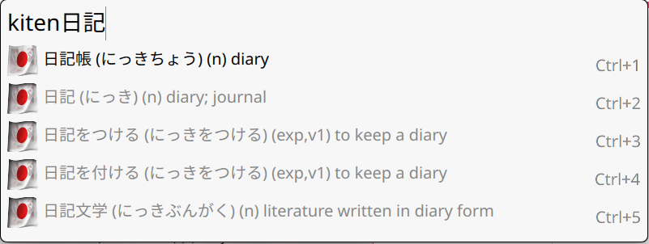

# Kiten Albert Launcher Integration

Query the Kiten Japanese dictionary directly from [Albert Launcher](https://github.com/albertlauncher/albert)

**Dependencies**

 - Albert Launcher with Python Extension Support
 - Qt5Core
 - Kiten
 - Python

# Building

**Dependencies**

 - CMake

Run `build.sh` from within the repository root directory.
The Python native extension is built in `out/lib/libkitenpy.so` and loaded from that location. Don't move it!
